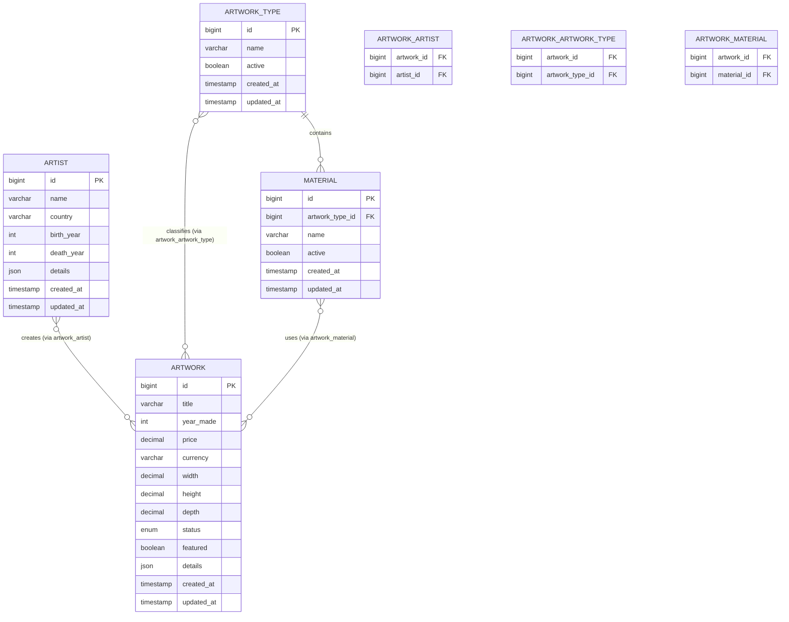

# Database Specification - Artwork Catalog

## 1. User Story

**As a** system administrator and application developer,

**I want** a database structure that properly represents artists, artworks, categories, materials, pricing, and artwork metadata,

**So that** the application can efficiently display, filter, sort, and manage original artworks.

---

# 2. Scope

This document defines the database design required for the Artwork Listing feature.

Included:

- Artist management
- Artwork management
- Artwork categorization
- Material classification
- Pricing
- Artwork status
- Flexible metadata storage

Excluded:

- Shopping cart
- Checkout
- Payment processing
- Customer management

---

# 3. Database Design Principles

## 3.1 Artwork as the Primary Domain Entity

The system uses **Artwork** as the primary business entity.

There is no Product or Product Variant entity because:

- Each artwork is unique.
- The application sells original artworks.
- Variants do not exist.

Relationship:

```
Artist
 |
 |
Artwork
```

---

## 3.2 Relational Data vs JSON Data

The database shall follow this principle:

### Store as database columns:

Information that is:

- Frequently filtered
- Frequently sorted
- Used for searching
- Used for joins
- Used for indexing

Examples:

- Artist ID
- Artwork Type
- Material
- Year Created
- Price
- Currency
- Status

---

### Store as JSON:

Information that is:

- Flexible
- Descriptive
- Expected to evolve
- Not frequently queried

Examples:

- Biography
- Provenance
- Exhibition history
- Certificates
- Additional metadata

---

# 4. Entity Relationship Diagram



---

# 5. Table Specifications

## 5.1 Artist Table

### Purpose

Stores artist information.

### Relationship

One artist can have many artworks. One artwork can have many artists (collaborative works).

---

### Columns

| Column | Type | Required | Description |
|-|-|-|-|
| id | bigint | Yes | Primary key |
| name | varchar | Yes | Artist name |
| country | varchar | No | Country associated with artist |
| birth_year | integer | No | Artist birth year |
| death_year | integer | No | Artist death year |
| details | JSON | No | Flexible artist metadata |
| created_at | timestamp | Yes | Creation timestamp |
| updated_at | timestamp | Yes | Update timestamp |

---

### Example JSON

```json
{
  "biography": "...",
  "education": [],
  "awards": [],
  "social_links": []
}
```

---

## 5.2 Artwork Table

### Purpose

Stores original artwork information.

---

### Columns

| Column | Type | Required | Description |
|-|-|-|-|
| id | bigint | Yes | Primary key |
| title | varchar | Yes | Artwork title |
| year_made | integer | No | Creation year |
| price | decimal | No | Artwork price |
| currency | varchar | No | Currency code |
| width | decimal | No | Artwork width |
| height | decimal | No | Artwork height |
| depth | decimal | No | Artwork depth |
| status | enum | Yes | Artwork lifecycle status |
| featured | boolean | Yes | Featured artwork flag (default: false) |
| details | JSON | No | Flexible metadata |
| created_at | timestamp | Yes | Creation timestamp |
| updated_at | timestamp | Yes | Update timestamp |

---

### Status Values

```
AVAILABLE
SOLD
RESERVED
DRAFT
```

Default: `DRAFT`

---

### Example JSON

```json
{
  "description": "...",
  "provenance": [],
  "exhibitions": [],
  "certificates": [],
  "framing": {},
  "restoration_history": []
}
```

---

## 5.3 Artwork Artist Table

### Purpose

Junction table linking artworks to artists. Supports collaborative works with multiple artists.

### Columns

| Column | Type | Required | Description |
|-|-|-|-|
| artwork_id | bigint | Yes | FK → artwork.id |
| artist_id | bigint | Yes | FK → artist.id |

Primary key: `(artwork_id, artist_id)`

---

## 5.4 Artwork Artwork Type Table

### Purpose

Junction table linking artworks to artwork types. An artwork may span multiple types.

### Columns

| Column | Type | Required | Description |
|-|-|-|-|
| artwork_id | bigint | Yes | FK → artwork.id |
| artwork_type_id | bigint | Yes | FK → artwork_type.id |

Primary key: `(artwork_id, artwork_type_id)`

---

## 5.5 Artwork Material Table

### Purpose

Junction table linking artworks to materials. An artwork may use multiple materials.

### Columns

| Column | Type | Required | Description |
|-|-|-|-|
| artwork_id | bigint | Yes | FK → artwork.id |
| material_id | bigint | Yes | FK → material.id |

Primary key: `(artwork_id, material_id)`

---

## 5.6 Artwork Type Table

### Purpose

Stores primary artwork categories.

Examples:

- Painting
- Photography
- Sculpture

---

### Columns

| Column | Type | Required | Description |
|-|-|-|-|
| id | bigint | Yes | Primary key |
| name | varchar | Yes | Unique type name |
| active | boolean | Yes | Whether this type is available for selection |
| created_at | timestamp | Yes | Creation timestamp |
| updated_at | timestamp | Yes | Update timestamp |

---

## 5.7 Material Table

### Purpose

Stores artwork materials. Materials belong to an artwork type.

Example:

- Painting → Oil, Acrylic
- Photography → Film, Digital Sensor

---

### Columns

| Column | Type | Required | Description |
|-|-|-|-|
| id | bigint | Yes | Primary key |
| artwork_type_id | bigint | Yes | FK → artwork_type.id |
| name | varchar | Yes | Material name |
| active | boolean | Yes | Whether this material is available for selection |
| created_at | timestamp | Yes | Creation timestamp |
| updated_at | timestamp | Yes | Update timestamp |

Unique constraint: `(artwork_type_id, name)`

---

# 6. Index Strategy

## Artwork

```
status
price
featured
year_made
```

## Artwork Artist

```
artwork_id
artist_id
```

## Artwork Artwork Type

```
artwork_id
artwork_type_id
```

## Artwork Material

```
artwork_id
material_id
```

## Artist

```
name
country
```

---

# 7. Constraints

## Artwork

- An artwork must have at least one artist.
- An artwork must have at least one artwork type.
- An artwork must have at least one material.
- Each material assigned to an artwork should belong to one of the artwork's assigned artwork types. This is enforced at the application level.
- `status` defaults to `DRAFT`.
- `featured` defaults to `false`.

## Artist

- `name` is required and must not be empty.

## Artwork Type

- `name` must be unique.

## Material

- `name` must be unique within an artwork type: `(artwork_type_id, name)`.

---

# 8. Future Extensibility

The schema should support future features:

- Multiple artwork images
- Collections
- Galleries
- Exhibitions
- Subjects
- Styles
- Advanced filtering

Potential future tables:

```
ARTWORK_IMAGE
ARTWORK_COLLECTION
STYLE
SUBJECT
GALLERY
```

---

# 9. Database Definition of Done

- [ ] Tables created.
- [ ] Relationships implemented.
- [ ] Foreign key constraints added.
- [ ] Indexes created.
- [ ] JSON fields documented.
- [ ] Seed data created for artwork types.
- [ ] Seed data created for materials.
- [ ] Migration scripts completed (using Prisma)
- [ ] Prisma schema file (`schema.prisma`) created

---

# 10. Reference

GitHub Issue: https://github.com/ArtworkApp/be-nestjs/issues/9
